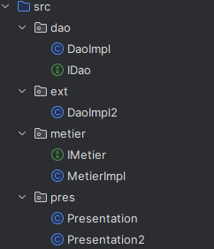
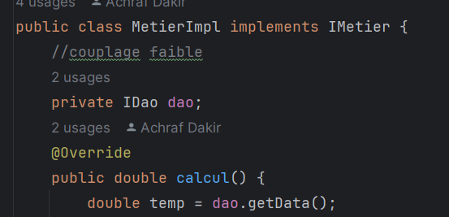
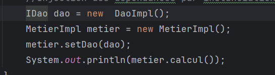
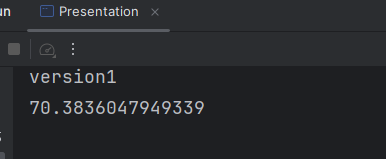
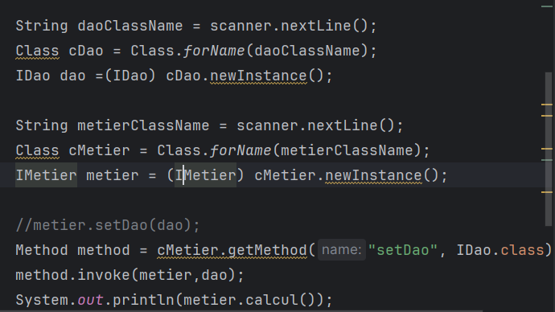
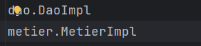
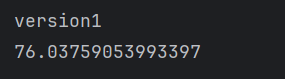
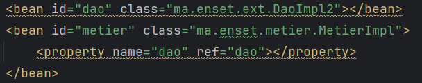
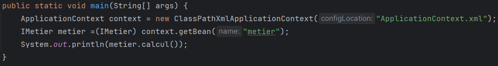
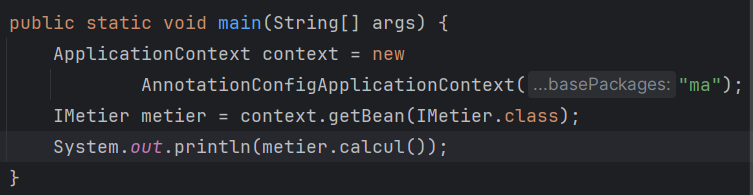

<h1>Compte Rendu</h1>
<h3>Partie 1</h3>

Création de l'interface <strong>IDAO</strong> et deux implémentation de cette interface <strong>DaoImpl</strong> et <strong>DaoImpl2</strong>

Création de l'interface <strong>IMetier</strong> avec une méthode calcul et implémentation de cette interface en utilisant le couplage faible

<h4 style="color: #0048ff">injection des dépendances Par instanciation statique</h4>

Résultat

<h4 style="color: #0048ff">injection des dépendances Par Par instanciation dynamique</h4>

Résultat

<h4>En utilisant le Framework Spring: version XML</h4>
Application Context :

<h4>En utilisant le Framework Spring: version Annotations</h4>
